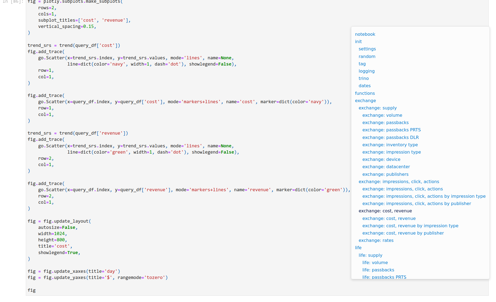

# jupyter-notebook-toc

Automatic TOC (table of contents) for the Jupyter Notebooks renders in HTML format



## add the code to the end of the Jupyter notebook

```python
import IPython.display

toc_script = '<script src="https://cdn.jsdelivr.net/gh/mazurkin/jupyter-notebook-toc@0.1/toc.js" async></script>'

IPython.display.display(
    IPython.display.HTML(toc_script)
)
```

## convert the notebook into HTML

```shell
jupyter nbconvert --to html --output "notebook" -y "notebook.ipynb"
```

## knows issue

keep all header titles unique, right now Jupyter assigns the same `id` to the headers if the text is the same:

https://github.com/jupyter/nbconvert/issues/1682
